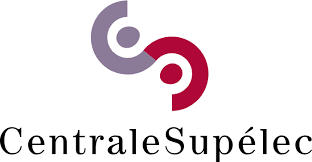

[](https://github.com/etalab-ia/OpenGateLLM/releases)
[](https://github.com/etalab-ia/OpenGateLLM)
[](https://github.com/etalab-ia/OpenGateLLM/blob/main/LICENSE)
[](https://github.com/etalab-ia/OpenGateLLM/stargazers)


# OpenGateLLM
### **[Documentation](https://docs.opengatellm.etalab.gouv.fr) | [API Reference](https://albert.api.etalab.gouv.fr/documentation)**

> [!WARNING]
> **The API is still under beta version, major breaking changes may occur.**

Production-ready API gateway for self-hosted LLMs developed by the French Government, fully open-source forever.

| Feature | Description |
|---|---|
| Gateway | • OpenAI compatible API<br>• Self-hosted models backend support: vLLM, HuggingFace TEI, Ollama <br>• Commercial backend support: OpenAI<br>• Full stack genAI API: chat, embeddings, transcription, RAG and OCR |
| Account services | • SSO support<br>• Organization, project, key management<br>• Budget, usage and carbon footprint monitoring |
| Monitoring | • Usage and carbon footprint monitoring |
| Privacy | • No chat history storage |

### 📊 Comparison
***

| Feature              | OpenGateLLM | LiteLLM   | OpenRouter |
| ---| ---| --- | --- |
| OpenAI Compatibility | ✅ | ✅ | ✅ |
| Open Source    | ✅ | ✅ | ❌ |
| Free (all features)    | ✅ | ❌ | ❌ |
| Support commercial models | ✅ | ✅ | ✅ |
| Support self-hosted models | ✅ | ✅ | ❌ |
| Built-in RAG         | ✅ | ❌ | ❌ |
| Built-in OCR         | ✅ | ❌ | ❌ |

### 🚀 Quickstart
***

Deploy OpenGateLLM quickly with Docker connected to our own free model and start using it:

```bash
make quickstart
```

> [!NOTE]
> It will copy the `config.example.yml` and `.env.example` files into `config.yml` and `.env` files if they don't already exist.

> [!TIP]
> Use `make help` to see all available commands.

Test the API:

```bash 
curl -X POST "http://localhost:8000/v1/chat/completions" \
-H "Content-Type: application/json" \
-H "Authorization: Bearer changeme" \
-d '{"model": "albert-testbed", "messages": [{"role": "user", "content": "Hello, how are you?"}]}'
```
The default master API key is `changeme`.

#### User interface

A user interface is available at: http://localhost:8501/playground

User: master
Password: changeme

#### Create a first user

```bash
make create-user
```

#### Configure your models and add features

With configuration file, you can connect to your own models and add addtionnal services to OpenGateLLM. 
Start by creating a configuration file and a .env dedicated:

```bash
cp config.example.yml config.yml
cp .env.example .env
```

Check the [configuration documentation](docs-legacy/configuration.md) to configure your configuration file.

Vou can then set your environment variables in .env according to your needs.

You can run the services you need by running:
```bash
docker compose --env-file .env up <services_you_need> --detach 
```

For instance:
```bash
docker compose --env-file .env up api playground postgres redis elasticsearch --detach 
```

#### Alternative: use kubernetes

You can check our helmchart and instructions here: [https://github.com/etalab-ia/albert-api-helm](https://github.com/etalab-ia/opengatellm-helm)

### 📘 Tutorials
***

Explore practical use cases:

| Tutorial | Link |
|----------|------|
| Chat Completions | [](https://colab.research.google.com/github/etalab-ia/opengatellm/blob/main/docs/tutorials/chat_completions.ipynb) |
| Multi-Model Access | [](https://colab.research.google.com/github/etalab-ia/opengatellm/blob/main/docs/tutorials/models.ipynb) |
| Retrieval-Augmented Generation (RAG) | [](https://colab.research.google.com/github/etalab-ia/opengatellm/blob/main/docs/tutorials/search_and_rag.ipynb) |
| Audio Transcriptions | [](https://colab.research.google.com/github/etalab-ia/opengatellm/blob/main/docs/tutorials/audio_transcriptions.ipynb) |
| Optical Character Recognition (OCR) | [](https://colab.research.google.com/github/etalab-ia/opengatellm/blob/main/docs/tutorials/ocr.ipynb) |

### 🤝 Contribute
***

This project exists thanks to all the people who contribute. OpenGateLLM thrives on open-source contributions. Join our community! 

Check out our [Contribution Guide](https://docs.opengatellm.etalab.gouv.fr/docs/contributing) to get started.

### 🎖️ Sponsors
***

<div id="toc">
  <ul align="center" style="list-style: none">
<a href="https://www.numerique.gouv.fr/numerique-etat/dinum/" ></a>
<a href="https://www.centralesupelec.fr"></a>
  </ul>
</div>

