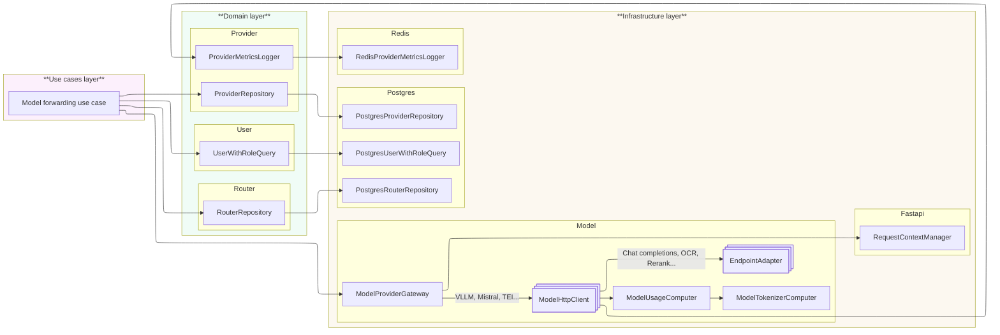

# ADR - 2026-05-28 - Refactoring model forwarding 

* **Status:**
* **Date:** 2026-05-28
* **Authors:** Development Team
* **Decision Outcome:**

---

### Context

The previous model forwarding path concentrated several responsibilities in infrastructure classes. The gateway selected providers, forwarded HTTP requests, adapted provider payloads, computed usage, updated metrics and relied on request context side effects. This made the forwarding flow hard to test in isolation and forced business rules to be spread across infrastructure objects.

The refactoring moves orchestration back to the use case layer. The use case now describes the complete business flow: load the user and router, validate access and router type, select a provider, build the endpoint adapter, compute prompt tokens, apply rate limits, forward the request, format the response, compute usage and log metrics. Infrastructure implementations remain replaceable details behind domain contracts.

This branch applies the pattern first to the rerank endpoint. The same structure is intended to be reused by the other model forwarding endpoints.

### Legend

### Previous architecture

### New architecture

The new architecture follows the principles of clean architecture: the model forwarding use case contains the business logic and directly orchestrates the domain abstractions. Dependencies remain simple to call and understand: objects do not call each other implicitly, they expose focused contracts that are explicitly composed by the use case.

#### Major changes

* **Use case as orchestrator:** `CreateRerankUseCase` owns the forwarding sequence and calls each dependency explicitly. This keeps the business flow readable in one place and avoids hidden calls between provider, router, metrics and HTTP objects.
* **Domain contracts for forwarding:** provider client, provider load balancer, router rate limiter, model tokenizer and environmental impact computer are exposed as domain abstractions. The use case depends on these contracts, not on Redis, HTTP, Ecologit or Tiktoken directly.
* **HTTP client simplified:** `HttpProviderClient` only sends an already formatted request to the selected provider and returns the raw provider response or a model error. It no longer owns endpoint selection, usage computation, metrics or rate limiting.
* **Endpoint adapters extracted:** provider-specific adapters convert OpenGate requests and responses to each provider format. `build_adapter` selects the right adapter from the source endpoint and provider type, while common usage computation stays in the base adapter.
* **Redis responsibilities isolated:** Redis implementations handle provider load balancing, provider metrics and router rate limits behind dedicated contracts. The use case decides when those operations happen.
* **Usage and impacts made explicit:** prompt tokens are computed before rate limiting, response usage is computed after provider response formatting, and environmental impacts are delegated to the Ecologit implementation through a domain contract.
* **FastAPI endpoint thinned:** the HTTP endpoint builds the command, calls the use case and maps domain errors to HTTP exceptions. It no longer contains forwarding logic.
* **Tests follow boundaries:** unit tests cover the use case and adapters, while integration tests cover Redis, HTTP client, Ecologit, Tiktoken, Postgres repositories and the rerank endpoint.

