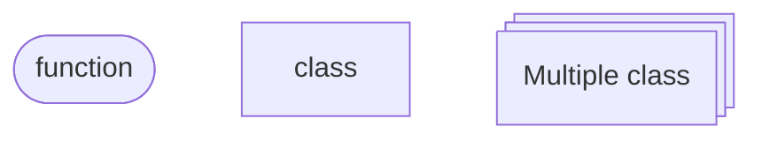
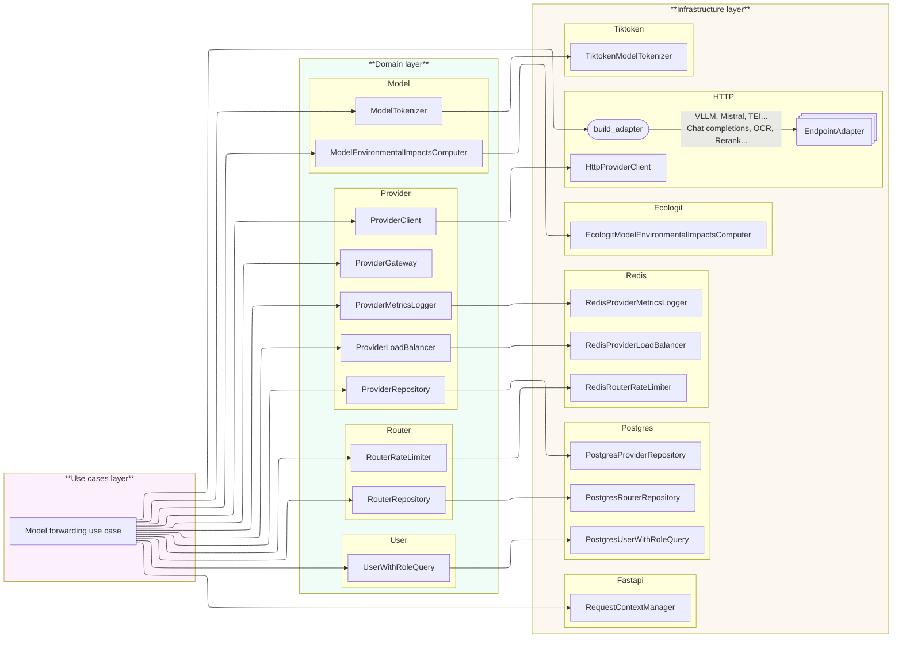

# ADR - 2026-05-28 - Refactoring model forwarding 

* **Status:**
* **Date:** 2026-05-28
* **Authors:** Development Team
* **Decision Outcome:**

---

### Legend

### Previous architecture

### New architecture

