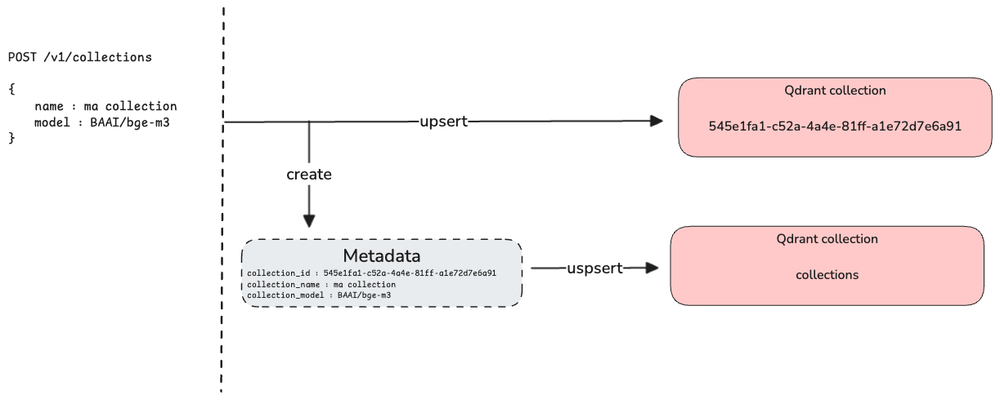
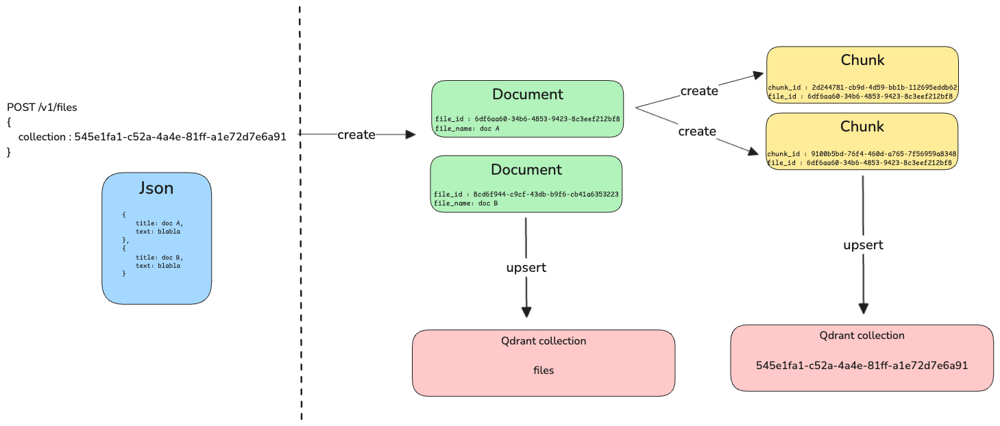
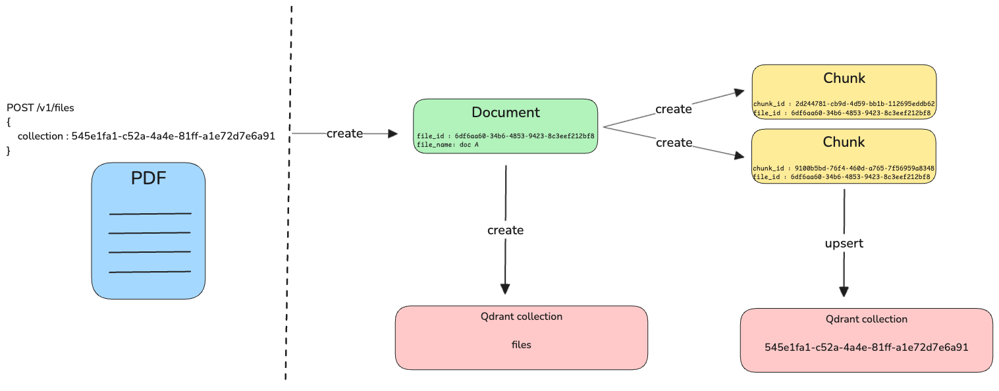

# Collections

L'API Albert propose d'interagir avec une base de données vectorielle (*vector store*) pour permettre de réaliser du [RAG](https://en.wikipedia.org/wiki/Retrieval-augmented_generation). L'API propose de nourrir ce vector store en important des fichiers qui seront automatiquement traités et insérés dans le *vector store*.

Les collections sont les espaces de stockage dans ce *vector store*. Elles sont utilisées pour organiser les fichiers qui sont importés par l'API. Ces fichiers sont découpés en chunks, qui sont eux-mêmes convertis en vecteurs à l'aide d'un modèle d'embeddings. Ces vecteurs ainsi que le texte qui a été vectorisé sont enregistrés dans la base de données vectorielle.

  

## Création d'une collection

Avant d'importer un fichier, il convient préalablement de créer une collection à l'aide du endpoint `POST /v1/collections`. Ce endpoint va réaliser 3 opérations successivement :

1. Créer un ID unique (*collection_id*). 
2. Créer une collection qui a pour nom l'ID.
3. Créer une entrée dans la collection nommée *collections* qui enregistre les métadonnées des autres collections. Ces métadonnées sont le nom de la collection, le nombre de fichiers dans la collection ainsi que le modèle d'embeddings associé à la collection. Cette entrée a le même ID que l'ID de la collection.

Vous pouvez consulter vos collections à l'aide du endpoint `GET /v1/collections`.

**Pourquoi enregistrer le nom d'un modèle d'embeddings pour chaque collection ?**

Il est important de comprendre que chaque collection est associée à un modèle d'embeddings car cela va conditionner la recherche de similarité entre plusieurs collections. En effet, comme le modèle d'embeddings définit un espace vectoriel qui lui est propre, il serait incohérent de faire une recherche de similarité entre des vecteurs qui n'ont pas été créés par le même modèle d'embeddings.

Ainsi, la conception de l'API rend impossible de faire une recherche de similarité sur des fichiers qui sont stockés dans deux collections associées à des modèles d'embeddings différents. De plus, en définissant dès la création de la collection un modèle d'embeddings associé, cela rend impossible d'avoir des fichiers vectorisés avec des modèles différents au sein de la même collection.

## Importer un fichier

Une fois la collection créée, vous pouvez importer des fichiers dans l'API avec l'endpoint `POST /v1/files`. Plusieurs types de fichiers sont acceptés par l'API dont JSON, PDF ou encore HTML. Le endpoint va réaliser les étapes suivantes : 

1. Détecter le type du fichier s'il n'est pas spécifié par l'utilisateur.
2. Créer un ID unique (*file_id*).
3. Créer une entrée dans une collection nommée *files* qui va stocker les métadonnées du fichier. Cette entrée a le même ID que l'ID du fichier.
4. Lancer la pipeline de traitement : 
   1. *parsing* : extraction du texte dans le fichier, dépend du type de fichier
   2. *chunking* : découpage du fichier en paragraphes (*chunks*)
   3. *vectorization* : création d'un vecteur par *chunk*
   4. *indexation* : insertion des *chunks* et de leurs vecteurs dans le *vector store*

Vous pouvez consulter les fichiers d'une collection à l'aide du endpoint `GET /v1/files/{collection}` en spécifiant l'ID de la collection. De même, vous pouvez consulter les *chunks* d'un fichier à l'aide du endpoint `GET /v1/chunks/{collection}/{file}` en spécifiant l'ID du fichier.

**Cas spécifique des JSON**

Le format JSON est adapté pour importer massivement de la donnée dans l'API Albert. En effet, contrairement aux autres types de fichiers, le JSON va être décomposé par l'API en plusieurs fichiers, chacun de ces fichiers sera alors converti en chunks. Ce JSON doit respecter une structure définie.

