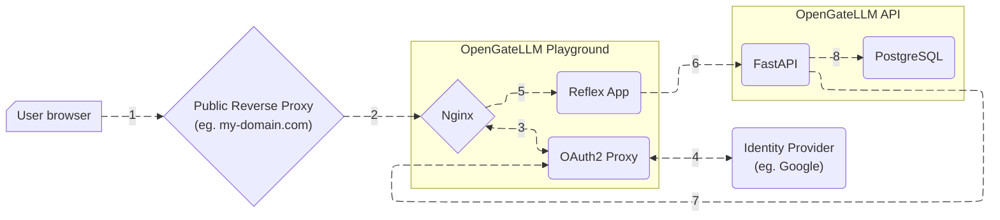

import { Aside, Tabs, TabItem } from '@astrojs/starlight/components';

OpenGateLLM supports Single Sign-On (SSO) through OIDC identity providers to log into the Playground as an alternative to the default password login.
This support is provided by [OAuth2 Proxy](https://oauth2-proxy.github.io/oauth2-proxy/) running inside the Playground container.

With SSO authentication flow, users are automatically created when they sign in for the first time.


## Authentication flow



1. The user enter the Playground URL into their browser and will be redirected to public reverse proxy where you publish yous services (eg. my-api.com, my-playground.com)
2. The public reverse proxy will redirect the user to the Playground container. In this container, the request is collected by a Nginx server.
3. The Nginx server will forward the request to the OAuth2 Proxy service.
4. The OAuth2 Proxy service will redirect the user to the identity provider (eg. Google, Azure, etc.). 
The user will authenticate and will be redirected back to the OAuth2 Proxy service with a session cookie.
The OAuth2 Proxy service validate the session cookie and forward the request to the Reflex App in Playground container.
5. The Reflex App will retrieve information about the user from the identity provider (`/userinfo` endpoint) like name, email, organization, and roles.
6. The Reflex App will call the OpenGateLLM API `/v1/auth/sso/login` endpoint with the session cookie and the user information.
7. The API will validate the session cookie by calling the OAuth2 Proxy service `/oauth2/auth` endpoint, then evaluate the SSO access policy stored in PostgreSQL.
8. If the user passes the access filters and a role mapping matches their OIDC organization and role claims, the API creates the user and organization when needed, then creates a new API key.

## Configuration

To activate SSO, set `auth_login_type` to `oidc` in the configuration file.
Configure the `auth_sso_*` settings for the Playground and `auth_playground_url` for the API. See the [Settings section](/configuration/configuration_file/#settings) in the configuration documentation for the full list of parameters.

In production, restrict network access to `/v1/auth/sso/login` so only the Playground can reach it. The API validates the oauth2-proxy session by calling `{auth_playground_url}/oauth2/auth` instead of re-validating OIDC tokens with the identity provider.

<Aside type="tip">
You can use the same configuration file for both the API and the Playground.
</Aside>

Rebuild the Playground image so the configuration is baked in, by passing the `CONFIG_FILE` build argument:

```bash
docker build --build-arg CONFIG_FILE=config.yml --file playground/Dockerfile --tag playground:latest .
```

### Access policy

SSO access rules are stored in PostgreSQL and managed from the Playground **SSO Access** admin page (`/sso-access`) or through the API endpoint `GET/PUT /v1/admin/sso/policy`.

Three optional access filters restrict who can sign in after OIDC authentication:

- **Allowed emails** — full email addresses or suffixes such as `@example.com`. A user matches when their email ends with one of the configured values.
- **Allowed organizations** — OIDC organization claim values.
- **Allowed roles** — OIDC role claim values.

Set `auth_sso_role_claim_field` and `auth_sso_organization_claim_field` in the configuration file so the Playground can read role and organization values from the identity provider `/userinfo` endpoint.

A **role mapping** is also required for every successful SSO login: each `(organization, OIDC role)` pair must map to an OpenGateLLM `role_id`. If no mapping matches, the API returns `403`.

#### Combination rules

- If all allowed lists are empty, every authenticated user passes the access filters.
- If exactly one list is non-empty, only that criterion is checked.
- If two or more lists are non-empty, a user is allowed when they match **any** of the enabled criteria (logical OR).

## Supported identity providers

<Tabs>
  <TabItem value="proconnect" label="ProConnect" icon="local:proconnect">
    ProConnect is the identity provider used for SSO on the OpenGateLLM Playground in French public administration deployments. To activate SSO, create a client on [partenaires.moncomptepro.beta.gouv.fr](https://partenaires.moncomptepro.beta.gouv.fr/).

    **Logout URL**

    ProConnect requires an RP-initiated logout call to the issuer `/session/end` endpoint. See section 2.4.1 in the [ProConnect technical documentation](https://partenaires.proconnect.gouv.fr/docs/fournisseur-service/implementation_technique) for details.

    Set `auth_sso_logout_redirect_uri` to the ProConnect logout URL. Build it from the issuer root URL and the OAuth2 Proxy sign-in URL (used as the post-logout redirect URI). Example values:

    - `oauth2_proxy_login_url`: `http://localhost:8501/oauth2/sign_in`
    - `issuer_url`: `https://fca.integ01.dev-agentconnect.fr/api/v2`

    ```python
    import secrets
    from urllib.parse import quote

    def build_proconnect_logout_url(issuer_url: str, oauth2_proxy_login_url: str) -> str:
        issuer_url = issuer_url.rstrip("/")
        encoded_redirect = quote(oauth2_proxy_login_url, safe="")
        state = secrets.token_urlsafe(32)
        return f"{issuer_url}/session/end?id_token_hint={{id_token}}&post_logout_redirect_uri={encoded_redirect}&state={quote(state, safe='')}"
    ```

    The `{id_token}` placeholder is substituted by OAuth2 Proxy when the user signs out.
  </TabItem>
</Tabs>
