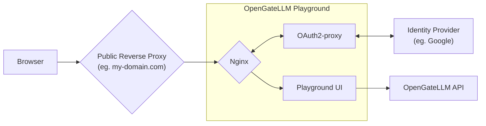

import { Tabs, TabItem } from '@astrojs/starlight/components';

OpenGateLLM support le Single Sign-On (SSO) pour se connecter au Playground en alternative au login par mot de passe par défaut. 
Ce support est assuré par OAuth2-proxy (voir [documentation OAuth2-proxy](https://oauth2-proxy.github.io/oauth2-proxy/)) depuis 
le container du playground.




## Configuration

To activate SSO, you need to set the `auth_login_type` to `oidc` in the configuration file. You need to provide the following settings:

  ```yaml
  settings:
    auth_login_type: oidc
    auth_sso_oidc_issuer_url: https://...
    auth_sso_client_id: ${OAUTH2_PROXY_CLIENT_ID}
    auth_sso_default_role_id: 1
    auth_oauth2_oidc_provider_logout_url:
  ```

* Pass the `OAUTH2_PROXY_*` environment variables to the *playground* container.

  Example configuration:
  ```yaml
  services:
    [...]

    playground:
      [...]
      build:
        context: .
        dockerfile: playground/Dockerfile
        args:
          CONFIG_FILE: config.yml
      env_file: .env
      environment:
        - "OPENGATELLM_URL=${OPENGATELLM_URL:-http://api:8000}"
        - "REDIS_HOST=redis"
        - "REDIS_PORT=${REDIS_PORT:-6379}"
        - "OAUTH2_PROXY_CLIENT_ID=${OAUTH2_PROXY_CLIENT_ID}"
        - "OAUTH2_PROXY_CLIENT_SECRET=${OAUTH2_PROXY_CLIENT_SECRET}"
        - "OAUTH2_PROXY_COOKIE_SECRET=${OAUTH2_PROXY_COOKIE_SECRET}"
      ports:
        - "${OAUTH2_PROXY_PORT:-8501}:4180"
      healthcheck:
        test: [ "CMD-SHELL", "curl -sf http://localhost:8501/ping || exit 1" ]
        interval: 5s
        timeout: 5s
        retries: 10
        start_period: 30s
      depends_on:
        redis:
        condition: service_healthy
      api:
        condition: service_healthy
  ```

  The playground image installs the [oauth2-proxy prebuilt binary](https://oauth2-proxy.github.io/oauth2-proxy/installation) and starts it with supervisord alongside nginx and the Reflex backend. When `OAUTH2_PROXY_CLIENT_ID` is not set, oauth2-proxy is skipped automatically.

  ```bash
  docker build --build-arg CONFIG_FILE=config.yml --file playground/Dockerfile --tag playground:latest .
  ```

* Setup OAuth2-proxy environment variables

| Variable | Description |
| --- | --- |
| `OAUTH2_PROXY_CLIENT_ID` | OAuth2-proxy client ID (see provider specifications). |
| `OAUTH2_PROXY_CLIENT_SECRET` | OAuth2-proxy client secret (see provider specifications). |
| `OAUTH2_PROXY_COOKIE_SECRET` | OAuth2-proxy cookie secret (see [this documentation](https://oauth2-proxy.github.io/oauth2-proxy/configuration/overview/#generating-a-cookie-secret)). |
| `OAUTH2_PROXY_OIDC_ISSUER_URL` | OAuth2-proxy OIDC issuer URL. |

* Setup configuration file

```yaml
settings: 
    [...]
    auth_login_type: oidc
    auth_sso_oidc_issuer_url: https://...
    auth_sso_client_id: ${OAUTH2_PROXY_CLIENT_ID}
    auth_sso_default_role_id: 1
    auth_oauth2_oidc_provider_logout_url: ${SSO_PROVIDER_LOGOUT_URL}
```

## Supported identity providers

<Tabs>
  <TabItem value="proconnect" label="ProConnect" icon="local:proconnect">
    ProConnect is the identity provider of the Single Sign-On (SSO) for the OpenGateLLM playground. To activate SSO, you need to create a client in ProConnect on https://partenaires.moncomptepro.beta.gouv.fr/.

    **Logout URL**

    ProConnect requires a RP-initiated logout call to the issuer `/session/end` endpoint. See 2.4.1 section in [ProConnect technical documentation](https://partenaires.proconnect.gouv.fr/docs/fournisseur-service/implementation_technique) for details.
    Generate `auth_oauth2_oidc_provider_logout_url` from the issuer root URL and the oauth2-proxy login URL (post logout redirect URI).
    You can use following function to generate the logout URL, example:
    - oauth2_proxy_login_url: `http://localhost:8501/oauth2/sign_in`
    - issuer_url: `https://fca.integ01.dev-agentconnect.fr/api/v2`

    ```python
    import secrets
    from urllib.parse import quote

    def build_proconnect_logout_url(issuer_url: str, oauth2_proxy_login_url: str) -> str:
        issuer_url = issuer_url.rstrip("/")
        encoded_redirect = quote(oauth2_proxy_login_url, safe="")
        state = secrets.token_urlsafe(32)
        return f"{issuer_url}/session/end?id_token_hint={{id_token}}&post_logout_redirect_uri={encoded_redirect}&state={quote(state, safe='')}"
    ```
  </TabItem>
</Tabs>