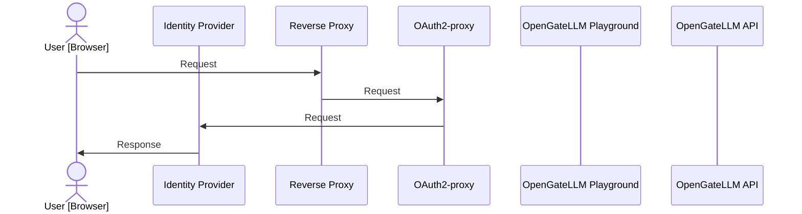

import { Tabs, TabItem } from '@astrojs/starlight/components';

OpenGateLLM supports Single Sign-On (SSO) with OAuth2-proxy (see [OAuth2-proxy documentation](https://oauth2-proxy.github.io/oauth2-proxy/)).




## Configuration

* Deploy OAuth2-proxy in a separate container.


  * Add an *oauth2-proxy* service in the `compose.yml` file using the image `quay.io/oauth2-proxy/oauth2-proxy:latest`.
  * Do not expose the port of the *playground* container (default 8501).
  * Expose the port of the *oauth2-proxy* container to the port of the *playground* container (default 8501).
  * Mount the `nginx.oauth2-proxy.conf` configuration file into the *playground* container.

  Example configuration:
  ```yaml
  services:
    [...]

    playground:
      [...]
      image: ghcr.io/etalab-ia/opengatellm/playground:latest
      env_file: .env
      environment:
        - "OPENGATELLM_URL=${OPENGATELLM_URL:-http://api:8000}"
        - "REDIS_HOST=redis"
        - "REDIS_PORT=${REDIS_PORT:-6379}"
      volumes:
        - "./nginx.oauth2-proxy.conf:/etc/nginx/conf.d/default.conf:ro"
      healthcheck:
        test: [ "CMD-SHELL", "curl -sf http://localhost:8501/ping || exit 1" ]
        interval: 5s
        timeout: 5s
        retries: 10
        start_period: 30s
      depends_on:
        redis:
        condition: service_healthy
      api:
        condition: service_healthy

    oauth2-proxy:
      image: quay.io/oauth2-proxy/oauth2-proxy:latest
      ports:
        - "${OAUTH2_PROXY_PORT:-8501}:4180"
      environment:
        - "OAUTH2_PROXY_CLIENT_ID=${OAUTH2_PROXY_CLIENT_ID}"
        - "OAUTH2_PROXY_CLIENT_SECRET=${OAUTH2_PROXY_CLIENT_SECRET}"
        - "OAUTH2_PROXY_COOKIE_SECRET=${OAUTH2_PROXY_COOKIE_SECRET}"
        - "OAUTH2_PROXY_PROVIDER=oidc"
        - "OAUTH2_PROXY_PROVIDER_DISPLAY_NAME=ProConnect"
        - "OAUTH2_PROXY_OIDC_ISSUER_URL=https://fca.integ01.dev-agentconnect.fr/api/v2"
        - "OAUTH2_PROXY_SCOPE=openid email profile"
        - "OAUTH2_PROXY_UPSTREAMS=http://playground:8501"
        - "OAUTH2_PROXY_REDIRECT_URL=http://localhost:8501/oauth2/callback"
        - "OAUTH2_PROXY_WHITELIST_DOMAINS=fca.integ01.dev-agentconnect.fr,localhost"
        - "OAUTH2_PROXY_EMAIL_DOMAINS=*"
        - "OAUTH2_PROXY_SET_XAUTHREQUEST=true"
        - "OAUTH2_PROXY_SET_AUTHORIZATION_HEADER=true"
        - "OAUTH2_PROXY_PASS_USER_HEADERS=true"
        - "OAUTH2_PROXY_PASS_ACCESS_TOKEN=true"
        - "OAUTH2_PROXY_PASS_AUTHORIZATION_HEADER=true"
        - "OAUTH2_PROXY_COOKIE_NAME=_oauth2_proxy_opengatellm"
        - "OAUTH2_PROXY_COOKIE_SECURE=false"
        - "OAUTH2_PROXY_COOKIE_SAMESITE=lax"
        - "OAUTH2_PROXY_HTTP_ADDRESS=0.0.0.0:4180"
        - "OAUTH2_PROXY_SKIP_PROVIDER_BUTTON=true"
        - "OAUTH2_PROXY_REQUEST_LOGGING=true"
        - "OAUTH2_PROXY_AUTH_LOGGING=true"
        - "OAUTH2_PROXY_STANDARD_LOGGING=true"
  ```

  For production, it is recommended to build your own playground image with environment variables to avoid mounting files. See [Environment variables](/configuration/environment_variable/) for the available environment variables.

  ```bash
  docker build --build-arg CONFIG_FILE=config.yml --file playground/Dockerfile --tag playground:latest .
  ```

* Setup OAuth2-proxy environment variables

| Variable | Description |
| --- | --- |
| `OAUTH2_PROXY_CLIENT_ID` | OAuth2-proxy client ID (see provider specifications). |
| `OAUTH2_PROXY_CLIENT_SECRET` | OAuth2-proxy client secret (see provider specifications). |
| `OAUTH2_PROXY_COOKIE_SECRET` | OAuth2-proxy cookie secret (see [this documentation](https://oauth2-proxy.github.io/oauth2-proxy/configuration/overview/#generating-a-cookie-secret)). |
| `OAUTH2_PROXY_OIDC_ISSUER_URL` | OAuth2-proxy OIDC issuer URL. |

* Setup configuration file

```yaml
settings: 
    [...]
    auth_login_type: oidc
    auth_oauth2_oidc_issuer_url: https://...
    auth_oauth2_oidc_client_id: ${OAUTH2_PROXY_CLIENT_ID}
    auth_oauth2_default_role_id: 1
    auth_oauth2_oidc_provider_logout_url: ${SSO_PROVIDER_LOGOUT_URL}
```

## Supported identity providers

<Tabs>
  <TabItem value="proconnect" label="ProConnect" icon="local:proconnect">
    ProConnect is the identity provider of the Single Sign-On (SSO) for the OpenGateLLM playground. To activate SSO, you need to create a client in ProConnect on https://partenaires.moncomptepro.beta.gouv.fr/.

    **Logout URL**

    ProConnect requires a RP-initiated logout call to the issuer `/session/end` endpoint. See 2.4.1 section in [ProConnect technical documentation](https://partenaires.proconnect.gouv.fr/docs/fournisseur-service/implementation_technique) for details.
    Generate `auth_oauth2_oidc_provider_logout_url` from the issuer root URL and the oauth2-proxy login URL (post logout redirect URI).
    You can use following function to generate the logout URL, example:
    - oauth2_proxy_login_url: `http://localhost:4180/oauth2/sign_in`
    - issuer_url: `https://fca.integ01.dev-agentconnect.fr/api/v2`

    ```python
    import secrets
    from urllib.parse import quote

    def build_proconnect_logout_url(issuer_url: str, oauth2_proxy_login_url: str) -> str:
        issuer_url = issuer_url.rstrip("/")
        encoded_redirect = quote(oauth2_proxy_login_url, safe="")
        state = secrets.token_urlsafe(32)
        return f"{issuer_url}/session/end?id_token_hint={{id_token}}&post_logout_redirect_uri={encoded_redirect}&state={quote(state, safe='')}"
    ```
  </TabItem>
</Tabs>