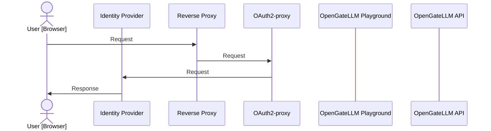

import { Tabs, TabItem } from '@astrojs/starlight/components';

OpenGateLLM supports Single Sign-On (SSO) with OAuth2-proxy (see [OAuth2-proxy documentation](https://oauth2-proxy.github.io/oauth2-proxy/)).




## Configuration

* Deploy OAuth2-proxy in a separate container.

```yaml
services:
  oauth2-proxy:
    image: quay.io/oauth2-proxy/oauth2-proxy:latest
    ports:
      - "${OAUTH2_PROXY_PORT:-4180}:4180"
    volumes:
      - "./oauth2-proxy.cfg:/oauth2-proxy.cfg:ro"
    environment:
      - "OAUTH2_PROXY_CLIENT_ID=${OAUTH2_PROXY_CLIENT_ID}"
      - "OAUTH2_PROXY_CLIENT_SECRET=${OAUTH2_PROXY_CLIENT_SECRET}"
      - "OAUTH2_PROXY_COOKIE_SECRET=${OAUTH2_PROXY_COOKIE_SECRET}"
      - "OAUTH2_PROXY_SKIP_PROVIDER_BUTTON=true"
      - "OAUTH2_PROXY_UPSTREAMS=http://playground:8501"
      - "OAUTH2_PROXY_SET_XAUTHREQUEST=true"
      - "OAUTH2_PROXY_SET_AUTHORIZATION_HEADER=true"
      - "OAUTH2_PROXY_PASS_USER_HEADERS=true"
      - "OAUTH2_PROXY_PASS_ACCESS_TOKEN=true"
      - "OAUTH2_PROXY_PASS_AUTHORIZATION_HEADER=true"
```

* Setup OAuth2-proxy environment variables

| Variable | Description |
| --- | --- |
| `OAUTH2_PROXY_CLIENT_ID` | OAuth2-proxy client ID (see provider specifications). |
| `OAUTH2_PROXY_CLIENT_SECRET` | OAuth2-proxy client secret (see provider specifications). |
| `OAUTH2_PROXY_COOKIE_SECRET` | OAuth2-proxy cookie secret (see [this documentation](https://oauth2-proxy.github.io/oauth2-proxy/configuration/overview/#generating-a-cookie-secret)). |

* Setup configuration file

```yaml
settings: 
    [...]
    playground_sso_enabled: True
    playground_sso_opengatellm_admin_api_key: sk-eyJhb...
    playground_sso_opengatellm_default_role_id: 1
    playground_sso_provider_logout_url: https://...
```

## Provider specifications

<Tabs>
  <TabItem value="proconnect" label="ProConnect" icon="local:proconnect">
    <p>ProConnect is the provider of the Single Sign-On (SSO) for the OpenGateLLM playground.</p>

    To activate SSO, you need to create a client in ProConnect on https://partenaires.moncomptepro.beta.gouv.fr/
  </TabItem>
</Tabs>