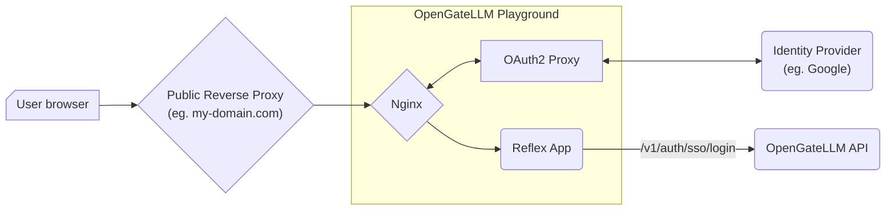

import { Aside, Tabs, TabItem } from '@astrojs/starlight/components';

OpenGateLLM support le Single Sign-On (SSO) via les fournisseurs d'identité OIDC pour se connecter au Playground en alternative au login par mot de passe par défaut. 
Ce support est assuré par OAuth2-proxy (voir [documentation OAuth2 Proxy](https://oauth2-proxy.github.io/oauth2-proxy/)) depuis 
le container du playground.




## Configuration

To activate SSO, you need to set the `auth_login_type` to `oidc` in the configuration file. You need to provide the following settings:

<Aside type="tip">
You can use the same configuration file for both the API and the Playground.
</Aside>

  * `auth_sso_logout_redirect_uri`


  * `auth_sso_cookie_secure`
  
    Whether the cookie is secure. Set to True if the application is served over HTTPS. Default is False.

  * `auth_sso_cookie_secret`

    Secret used to sign the OAuth2-proxy cookies. If not provided, a random secret will be generated. To generate a secret, you can see the dedicated 
    section in the [OAuth2-proxy documentation](https://oauth2-proxy.github.io/oauth2-proxy/configuration/overview/#generating-a-cookie-secret).

  * `auth_sso_allowed_email_domains`
  
  Si vide, toutes les adresses email sont autorisées, sauf si `auth_sso_allowed_groups` est défini.

  * `auth_sso_allowed_groups`
  Si vide, toutes les groupes sont autorisées, sauf si `auth_sso_allowed_email_domains` est défini.


  The playground image installs the [oauth2-proxy prebuilt binary](https://oauth2-proxy.github.io/oauth2-proxy/installation) and starts it with supervisord alongside nginx and the Reflex backend. When `OAUTH2_PROXY_CLIENT_ID` is not set, oauth2-proxy is skipped automatically.

  ```bash
  docker build --build-arg CONFIG_FILE=config.yml --file playground/Dockerfile --tag playground:latest .
  ```

## Supported identity providers

<Tabs>
  <TabItem value="proconnect" label="ProConnect" icon="local:proconnect">
    ProConnect is the identity provider of the Single Sign-On (SSO) for the OpenGateLLM playground. To activate SSO, you need to create a client in ProConnect on https://partenaires.moncomptepro.beta.gouv.fr/.

    **Logout URL**

    ProConnect requires a RP-initiated logout call to the issuer `/session/end` endpoint. See 2.4.1 section in [ProConnect technical documentation](https://partenaires.proconnect.gouv.fr/docs/fournisseur-service/implementation_technique) for details.
    Generate `auth_oauth2_oidc_provider_logout_url` from the issuer root URL and the oauth2-proxy login URL (post logout redirect URI).
    You can use following function to generate the logout URL, example:
    - oauth2_proxy_login_url: `http://localhost:8501/oauth2/sign_in`
    - issuer_url: `https://fca.integ01.dev-agentconnect.fr/api/v2`

    ```python
    import secrets
    from urllib.parse import quote

    def build_proconnect_logout_url(issuer_url: str, oauth2_proxy_login_url: str) -> str:
        issuer_url = issuer_url.rstrip("/")
        encoded_redirect = quote(oauth2_proxy_login_url, safe="")
        state = secrets.token_urlsafe(32)
        return f"{issuer_url}/session/end?id_token_hint={{id_token}}&post_logout_redirect_uri={encoded_redirect}&state={quote(state, safe='')}"
    ```
  </TabItem>
</Tabs>