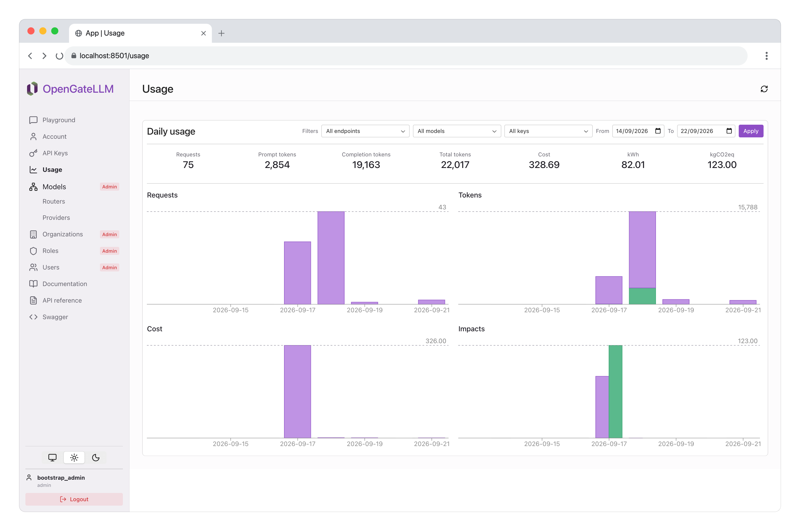

import { Aside, LinkButton, TabItem, Tabs } from '@astrojs/starlight/components';

## Request usage logging

OpenGateLLM records usage for each model-forward API request (chat completions, embeddings, OCR, rerank, audio transcriptions). This helps you analyze consumption over time, identify patterns, and support reporting.

The usage backend is selected with the `settings.usage_source` setting:

- `postgres` (default): usage is recorded in and read from the PostgreSQL `usage` table.
- `langfuse`: usage is recorded in and read from **Langfuse** instead. This requires the [Langfuse dependency](/configuration/dependencies/langfuse/) to be configured; otherwise OpenGateLLM fails to start.

A single backend both records and serves usage, so requests are never dual-written. `GET /v1/usage` (and the Playground *Usage* page) reads from whichever backend is selected. Budget deduction always stays on PostgreSQL, independently of `usage_source`.

Sensitive information such as the prompt or response content is not included in the logs.

In both cases, the logs contain the following information:
- user ID
- router ID
- provider ID
- number of input tokens
- number of output tokens
- environmental footprint (see the dedicated documentation [here](/features/usage/environmental_footprint/))
- cost (see the dedicated documentation [here](/features/usage/budget/))

<Aside type="caution" title="Environmental impacts with Langfuse">
When `usage_source` is `langfuse`, environmental impacts (`kWh`, `kgCO2eq`) are stored as Langfuse scores, which the usage query API cannot aggregate. They are reported as `0` in the daily usage buckets returned by `GET /v1/usage`. Use `usage_source: postgres` if you need environmental impacts in usage reports.
</Aside>

User can see their usage in the *Usage* page of the Playground.



## Real-time metrics

In addition to the usage data stored in PostgreSQL, OpenGateLLM can expose real-time inference metrics (request rate, request duration, time to first token, token consumption and output generation speed) in Prometheus format on the `/metrics` endpoint.

Ready-to-use Grafana dashboards built on these metrics are available in the [`grafana/`](https://github.com/etalab-ia/OpenGateLLM/tree/main/grafana) folder of the repository. See the [Prometheus documentation](/configuration/dependencies/prometheus/) for the list of exposed metrics, the dashboards and the configuration.

<LinkButton href="/configuration/dependencies/prometheus/" icon="external">Prometheus documentation</LinkButton>

## Model health monitoring

OpenGateLLM provides a health check endpoint to monitor the health of the models. This endpoint is available at `/health/models` and returns a JSON response with the health status of the models.

```json
{
  "data": [
    {
      "id": "model_name",
      "status": "green" | "yellow" | "red"
    }
  ]
}
```


The endpoint requires authentication. It only returns models (routers) the calling user is allowed to access.

### Status values

Each model is assigned one of three statuses:

| Status | Meaning |
| --- | --- |
| `green` | The provider responds and queue depth is within normal bounds. |
| `yellow` | The provider responds but is under moderate load. |
| `red` | The provider is unreachable, metrics are unavailable, or queue depth indicates severe degradation. |

The default status is **green**. Status only escalates during the check; it is never downgraded back to green once a worse condition is detected.

### How status is computed

Health is evaluated **per model** (router). A model can have several providers; the model status is the **worst status** among its providers (`red` > `yellow` > `green`).

For each provider attached to the model, OpenGateLLM probes the inference backend:

1. **Metrics-capable providers** (vLLM and on-prem Mistral): query the provider `/metrics` endpoint (Prometheus format) and read `vllm:num_requests_waiting` and `vllm:num_requests_running` for the configured model name.
2. **Other providers**: `/metrics` is not supported yet. OpenGateLLM falls back to `/v1/models` instead. If that endpoint returns a successful response, the provider is considered **green**. If it fails, the provider is **red**.

In all cases, a failed or unparseable metrics response sets the provider to **red**.

### Load-test thresholds

Queue-depth thresholds were calibrated against load tests targeting the following service conditions:

- **Time to first token (TTFT)** &lt; 5 seconds
- **Throughput** &gt; 30 tokens/second

Under load, these targets correlate with the yellow and red boundaries below:

| Status | Observed degradation (load tests) |
| --- | --- |
| `yellow` | p95 TTFT reaches 5 seconds, or throughput drops below 31 tokens/second |
| `red` | TTFT reaches 40 seconds, or throughput drops below 27 tokens/second |

The health check does not measure TTFT or throughput directly. It uses waiting and running request counts from provider metrics as proxies for these conditions.

### Provider-specific rules

<Tabs>
  <TabItem value="vllm" label="vLLM" icon="lobe:vllm-color">
    | Condition | Status |
    | --- | --- |
    | `/metrics` unavailable or invalid | `red` |
    | `num_requests_waiting` &gt; 0 | `yellow` |
    | `num_requests_running` &gt; 20 | `red` |
  </TabItem>

  <TabItem value="mistral" label="Mistral On-Prem" icon="lobe:mistral-color">
    | Condition | Status |
    | --- | --- |
    | `/metrics` unavailable or invalid | `red` |
    | `num_requests_running` &gt; 58 | `yellow` |
    | `num_requests_running` &gt; 63 | `red` |
  </TabItem>

  <TabItem value="other" label="Other providers">
    | Condition | Status |
    | --- | --- |
    | `/v1/models` unavailable | `red` |
    | `/v1/models` responds successfully | `green` |
  </TabItem>
</Tabs>
