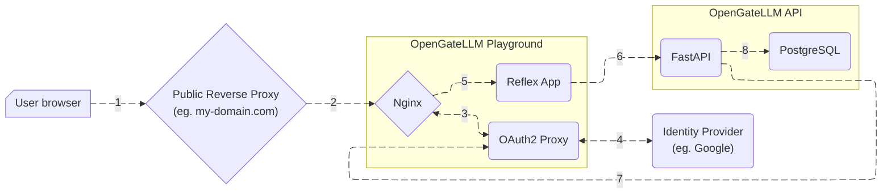
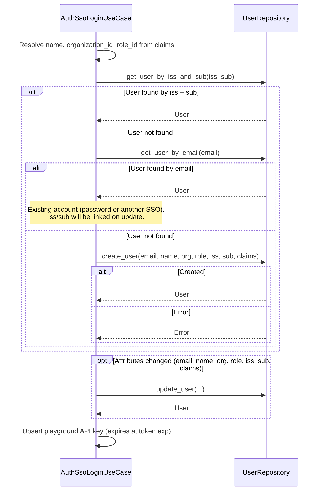

import { Aside, Tabs, TabItem } from '@astrojs/starlight/components';

OpenGateLLM supports Single Sign-On (SSO) through OIDC identity providers to log into the Playground as an alternative to the default password login.
This support is provided by [OAuth2 Proxy](https://oauth2-proxy.github.io/oauth2-proxy/) running inside the Playground container.

With SSO authentication flow, users are automatically created when they sign in for the first time.

## Configuration

To activate SSO, set `auth_login_type` to `oidc` in the configuration file.
Configure the `auth_sso_*` settings for the Playground and for the API. See the [Settings section](/configuration/configuration_file/#settings) in the configuration documentation for the full list of parameters.

<Aside type="tip">
You can use the same configuration file for both the API and the Playground.
</Aside>

For Playground container, build the docker image so the configuration is baked in, by passing the `CONFIG_FILE` build argument:

```bash
docker build --build-arg CONFIG_FILE=config.yml --file playground/Dockerfile --tag playground:latest .
```

## Supported identity providers

OpenGateLLM supports **all identity providers that support the OIDC protocol** (eg. Google, Azure, etc.). 
You can use the [oauth2-proxy documentation](https://oauth2-proxy.github.io/oauth2-proxy/configuration/providers/) to configure your identity provider.

## Access policy

### Default access policy

By default, every user authenticated by the identity provider can access the Playground. No extra email, organization, or role filters are applied.

New users are created on first SSO login with the default role and organization from the [configuration file](/configuration/configuration_file/#settings) (`auth_sso_default_role_id`, `auth_sso_default_organization_id`).

On each login, the API also keeps the local user in sync with the identity provider:

- **Existing accounts** — if a user already exists (password login or a previous SSO provider) and no `iss`/`sub` match is found, the account is linked by email and the new `iss`/`sub` are stored.
- **Email changes** — if the identity provider returns a different email for the same `iss`/`sub`, the local email is updated.
- **Provider changes** — if you switch to another OIDC provider, existing users are matched again by email and relinked to the new `iss`/`sub`.

> See [Access policy evaluation](#access-policy-evaluation) for more details

### Custom access policy

SSO access, user name, organization, and role resolution are handled by the API use case behind `POST /v1/auth/sso/login`: [*AuthSsoLoginUseCase*](https://github.com/etalab-ia/OpenGateLLM/blob/main/api/use_cases/auth/_authssologinusecase.py).

To customize this behavior, override the use case file in the API container and mount your customized file over the built-in use case path.

Example with Docker Compose:
```yaml
services:
  api:
    [...]
    volumes:
      - ./custom_authssologinusecase.py:/api/use_cases/auth/_authssologinusecase.py
```
<Aside type="caution">
You must keep the same module layout and class name `AuthSsoLoginUseCase` so dependency injection continues to load it.
</Aside>

## How it works

### Authentication flow



1. The user enter the Playground URL into their browser and will be redirected to public reverse proxy where you publish yous services (eg. my-api.com, my-playground.com)
2. The public reverse proxy will redirect the user to the Playground container. In this container, the request is collected by a Nginx server.

<Aside type="caution" title="WebSocket on the public reverse proxy">
The Playground frontend talks to the Reflex backend over `wss://<host>/_event`. If the public reverse proxy does not forward the `Upgrade` and `Connection` headers, the UI stays on "Login processing…" with a websocket error.

```nginx
map $http_upgrade $connection_upgrade {
    default close;
    ~*^websocket$ upgrade;
}

location /_event {
    proxy_pass http://<playground_host>:8501;
    proxy_http_version 1.1;
    proxy_set_header Host $host;
    proxy_set_header Upgrade $http_upgrade;
    proxy_set_header Connection $connection_upgrade;
    proxy_read_timeout 86400;
}
```
</Aside>
3. The Nginx server will forward the request to the OAuth2 Proxy service.
4. The OAuth2 Proxy service will redirect the user to the identity provider (eg. Google, Azure, etc.). 
The user will authenticate and will be redirected back to the OAuth2 Proxy service with a session cookie.
The OAuth2 Proxy service validate the session cookie and forward the request to the Reflex App in Playground container.
5. The Reflex App will retrieve user claims (eg. user information, organization, role, etc.) from the identity provider (`/userinfo` endpoint of the identity provider).
6. The Reflex App will call the OpenGateLLM API `/v1/auth/sso/login` endpoint with the session cookie and the user claims.
7. The API will validate the session cookie by calling the OAuth2 Proxy service `/oauth2/auth` endpoint, then evaluate access.
8. If the user passes the access filters, the API endpoint `/v1/auth/sso/login` creates the user and organization when needed, then returns a fresh API key for playground access (hidden in the playground).

### Access policy evaluation

After session validation and access checks, the API resolves the OpenGateLLM user as follows:


