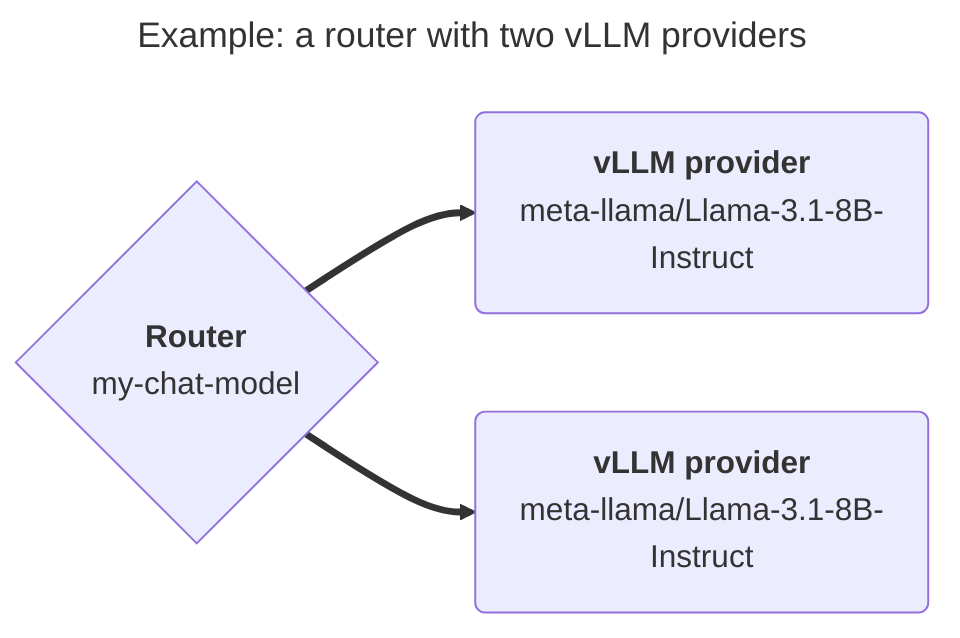

import { Aside, LinkButton, Steps, TabItem, Tabs } from '@astrojs/starlight/components';

To expose a model through OpenGateLLM, you configure:

- **A router**: the model name visible to users (e.g. `my-chat-model`).
- **One or more providers APIs**: the real inference backends behind this router (OpenAI, vLLM, Mistral, Hugging Face Text Embeddings Inference, etc.).

When a user calls a router (`/v1/chat/completions`, `/v1/embeddings`, ...) with this name (e.g. `my-chat-model`), OpenGateLLM load-balances requests across its configured providers API.

<Aside type="tip" title="Supported models">
Check the list of supported model provider APIs [here](/features/supported_models/).
</Aside>

## Configuration flow

1. Create a router.
2. Attach one or more providers to this router.
3. (Optional) Apply a rate limiting policy to the router.
   See [rate limiting](/features/usage/rate_limiting/).

<Tabs>
  <TabItem value="playground" label="Playground UI" icon="lucide:laptop">
  <Steps>
    <ol>
      <li>
        Open <strong>Routers</strong> and create a router:
        <ul>
          <li><code>name</code>: model name shown to users.</li>
          <li><code>type</code>: model type (for example <code>text-generation</code>).</li>
          <li><code>load_balancing_strategy</code>: <code>shuffle</code> (default) or <code>least_busy</code>.</li>
          <li><code>aliases</code> (optional): additional names for the same router.</li>
        </ul>
      </li>
      <li>
        Open <strong>Providers</strong> and create at least one provider linked to this router:
        <ul>
          <li><code>router</code>: router ID.</li>
          <li><code>type</code>: provider type.</li>
          <li><code>model_name</code>: real model name on the provider side.</li>
          <li><code>url</code> (optional for some provider types): provider base URL (domain only, without <code>/v1</code>).</li>
          <li><code>key</code> (optional): API key.</li>
          <li><code>timeout</code> (optional): request timeout in seconds.</li>
        </ul>
      </li>
    </ol>
  </Steps>
  </TabItem>

  <TabItem value="config" label="API" icon="lucide:code">
  <Steps>
    <ol>
      <li>
        Create a router.
        Use POST <code>/v1/admin/routers</code> endpoint.
      </li>
      <li>
        Create a provider with POST <code>/v1/admin/providers</code> endpoint.
      </li>
      <li>
        Verify configuration.
        Use GET <code>/v1/models</code> endpoint.
      </li>

      <LinkButton href="/reference/" icon="external">See API Reference</LinkButton>
    </ol>
  </Steps>
  </TabItem>

</Tabs>
